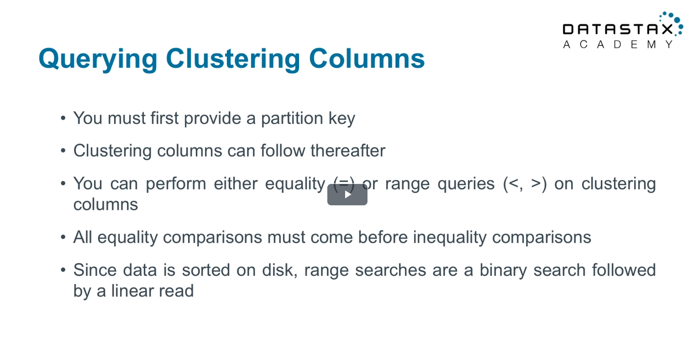

Query rules in Cassandra
---

Cassandra has some rules about querying, which to a bran-new user of the database, might seem a little weird, but once you understand how Cassandra works, it makes sense. Unlike SQL, you can't just to any old `select * where column=value`. Depending on the column and the value, the query could be very inefficient, requiring searching from multiple different partitions. So Cassandra makes you query against columns in the primary key. If you don'f follow the rules, you'll probably get an error that tells you that you can use `ALLOW FILTERING` if you absolutely have to. When building queries for applications, *never* use `ALLOW FILTERING`. That will be slow.

Rules:
- The query must have a restriction on a column in the partition key.
- If the query has a restriction on the clustering columns, you must restrict on the columns in order. E.g. if you defined the clustering columns to be "email", "state", "age" (in that order), you wouldn't be able to restrict "state" without restricting "email".



There are probably more rules, but those are the most important.

An example from exercise 3 from DS201:

With the table defined as follows: 

```sql
CREATE TABLE videos_by_tag (
tag TEXT,
video_id UUID,
added_date TIMESTAMP,
title TEXT,
PRIMARY KEY ((tag), video_id)
);
```

> 12) Finally, write a query to retrieve the video having a title of Cassandra Intro.

```sql
SELECT *
FROM videos_by_tag
WHERE title = 'Cassandra Intro';
```

This returns
```
InvalidRequest: Error from server: code=2200 [Invalid query] message="Cannot execute this query as it might involve data filtering and thus may have unpredictable performance. If you want to execute this query despite the performance unpredictability, use ALLOW FILTERING"
```

> NOTE: Notice your query errors out. Apache CassandraTM only allows queries on the partition key (and clustering columns shown in the next section). Since `title` is not the partition key, Apache CassandraTM fails the query. If Apache CassandraTM allowed querying on non-partition key columns, Apache CassandraTM would have to scan all partitions on all nodes to produce a result set (which goes against the reason you would use Apache CassandraTM in the first place).